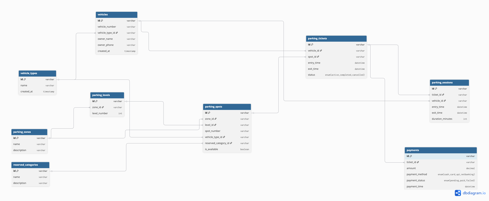

# Comic-Con India Parking Management System

A scalable multi-zone parking management system designed for large event venues like Comic-Con India, where thousands of visitors arrive across multiple days.

---

## Overview

Managing parking during large events is complex due to:

- Multiple vehicle types (bike, car, SUV, EV, cab)
- Reserved parking categories (VIP, creators, exhibitors, etc.)
- Multi-level and multi-zone structure
- Continuous vehicle entry and exit

This system automates the entire parking workflow including ticketing, allocation, tracking, and payments.

---

##  Features

- Vehicle Entry & Exit Tracking  
- Smart Parking Spot Allocation  
- Vehicle Category Management  
- Reserved Parking Zones  
- Parking Session Tracking  
- Payment & Billing System  
- Real-time Spot Availability  

---

## Modules

### Vehicle Management
Stores vehicle details and types:
- Bike
- Car
- SUV
- EV
- Cab

---

### Parking Zones & Levels
- Multiple zones
- Multiple levels (floors)
- Organized parking structure

---

### Parking Spots
Each spot includes:
- Spot type (Car/Bike/EV)
- Availability status
- Reserved category (optional)

---

### Reserved Categories
- VIP Guests  
- Creators  
- Exhibitors  
- Cosplayers  
- Staff  
- EV Charging  

---

### Parking Tickets
Generated at entry:
- Ticket ID  
- Vehicle ID  
- Entry Time  
- Spot ID  
- Zone & Level  

---

### Parking Sessions
Tracks:
- Entry time  
- Exit time  
- Duration  

---

### Payment System
- Fee calculation based on time
- Payment status (Paid / Pending)
- Payment method

---

## Database Tables

- vehicles  
- vehicle_types  
- parking_zones  
- parking_levels  
- parking_spots  
- reserved_categories  
- parking_tickets  
- parking_sessions  
- payments  

---

## Relationships

- Vehicle → Vehicle Type  
- Parking Spot → Zone, Level, Reserved Category  
- Ticket → Vehicle + Spot  
- Session → Ticket  
- Payment → Session  

---

## Workflow

### Entry
1. Vehicle enters  
2. System detects type  
3. Allocates parking spot  
4. Generates ticket  
5. Marks spot occupied  

### Exit
1. Vehicle exits  
2. Exit time recorded  
3. Fee calculated  
4. Payment processed  
5. Spot freed  

---

## Tech Stack

- Frontend: Angular / React  
- Backend: Node.js / Laravel  
- Database: MySQL / PostgreSQL  
- Deployment: Docker  

---

##  Future Improvements

- EV charging management  
- Mobile app integration  
- AI-based parking prediction  
- License plate recognition  

---
## ER Diagram

